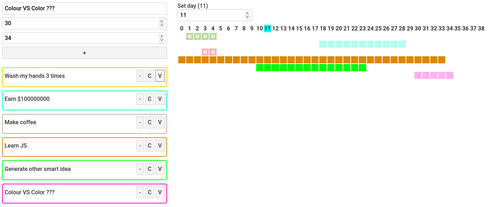
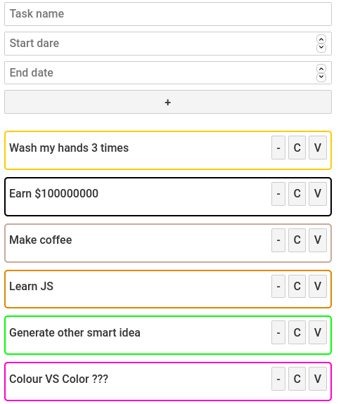
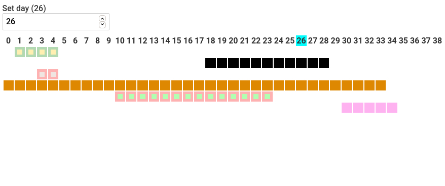
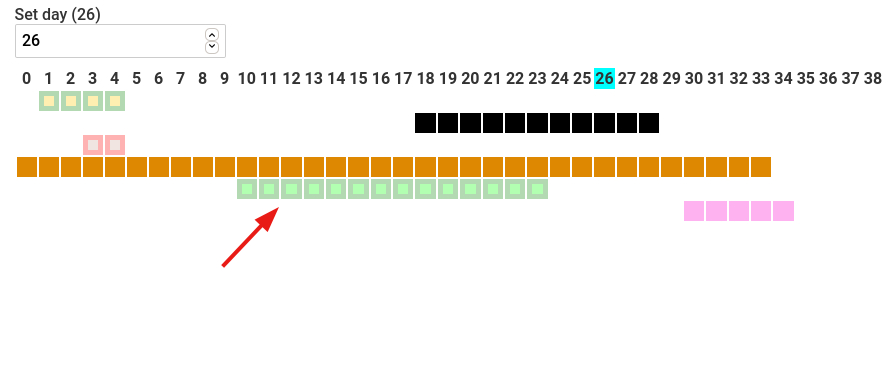

# Colorful task managing calendar on Svelte

This time I try to implement a task calendar in which each task is represented
as a bar on the graph below the timeline. This is my first Svelte3 project.

## Motivation

I want to touch another framework and see what I like and what I don't like.

By itself, this type of calendars is quite convenient for tracking projects and tasks.

## Technical Task

My Application have to:
1. Create, delete tasks.
2. Choose colour of eny task
3. Display tasks as lines on Timeline graph

## Abilities & Screenshots
Applications screen contains two independent elements: Menu and Graph.
Theese components are linked by Svelte store "calendarStore": both of them are subscribed to changes.

### Task creation and deletion
Operating with tasks could be performed by Menu component:

Any Task entry has 3 buttons (left-to-right):
1.Delete
2.Change colour
3.Finish (Mark as done)

Also any tasks entry border is coloured with current tasks colour.

### Current, future, completed and overdue tasks
In any real task managing calendar there is a current date. Mine has date too, but as parametrical value.
You can set any date you want and see what happens.

Depending on present date parameter value any task can be in following states:
1. Active -- current date is between tasks start and end dates. (full colour)
2. Future -- current date is before tasks start date. (opacity)
3. Expired -- current date is after tasks end date and task is not marked as "done". (red border)
4. Done -- task is marked as "done". (green border)

## Building from source
* Setup node environment and run `npm install`
* `npm run dev` or `npm run build`